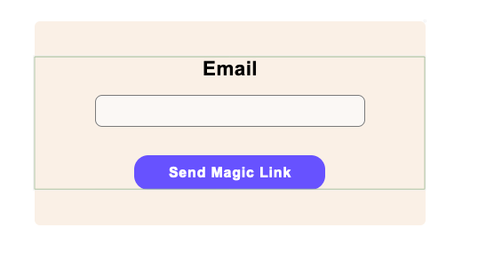
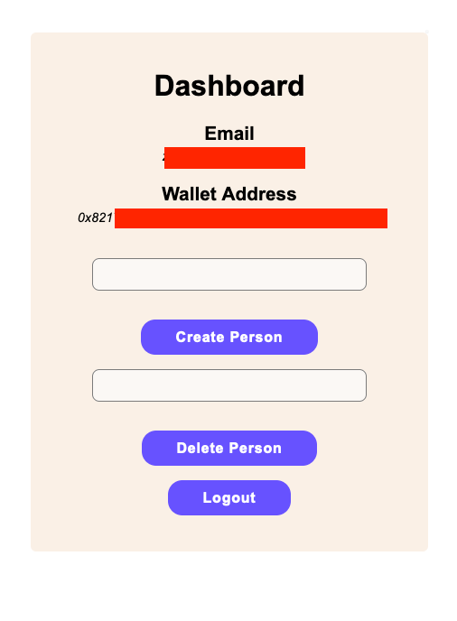

## Sample app for using a `signer` with `Polybase`

  1. This repository is based on the following (completed) template - https://github.com/magiclabs/vercel-magic-guide. The associated guide is: https://vercel.com/guides/add-auth-to-nextjs-with-magic.

  2. We use the `web3` library (https://magic.link/docs/blockchains/featured-chains/ethereum/javascript#web3.js-2). The `ethers` library may work, but I could not get it to work for me.

  3. Go to the `Polybase` explorer Studio and create a new app called `PersonApp`.

  4. Fill in the following schema:

  ```typescript
    @read
    collection Person {
      id: string;

      @delegate
      publicKey: PublicKey;

      
      constructor (id: string) {
        this.id = id;
        this.publicKey = ctx.publicKey;
      }

      @call(publicKey)
      function del () {
        selfdestruct();
      }
    }
  ```
  5. Setup and Run the project:

   * Install the dependencies:

        ```shell
        npm install
        # or
        yarn install
        ```

    * Rename `.env.local.example` to `.env.local` and add your Magic Auth API keys.

        ```shell
        mv .env.local.example .env.local
        ```

        ```javascript
        // .env.local

        NEXT_PUBLIC_MAGIC_PUBLISHABLE_KEY = "YOUR MAGIC AUTH PUBLISHABLE KEY";
        MAGIC_SECRET_KEY = "YOUR MAGIC AUTH SECRET KEY";
        ```

        ```shell
        npm run dev
        # or
        yarn dev
        ```

    * Open http://localhost:3000 with your browser to see the result.

  6. Enter your email and follow the usual "magic link" steps. After these steps, if need be, refresh the page a couple of times till you see the dashboard.

    

  7. You get two options in the dashboard - "Create Person" and "Delete Person". Create a bunch of persons and see them appear in the `Polybase` explorer.

    

  8. Then delete some person (using the same string/id as was used during creation) by entering it in the "Delete Person" input and clicking "Delete Person". 
     Check the `Polybase` explorer to ensure that the person has been deleted.

Note: Most of the code is boilerplate from the template. For the relevant changes to add a signer, refer to `pages/dashboard.js`.

References: https://web3js.readthedocs.io/en/v1.10.0/web3-eth-personal.html (web3)
